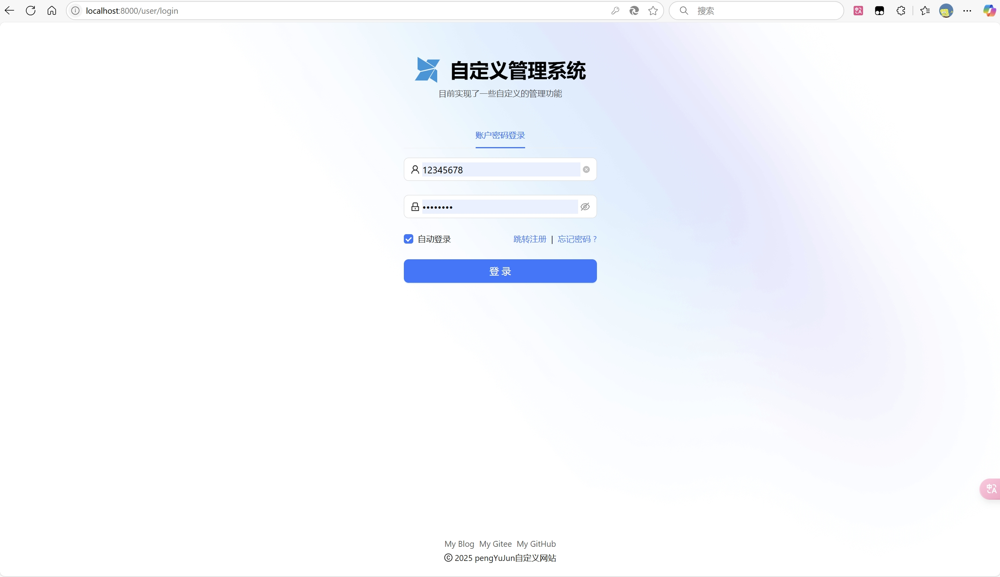
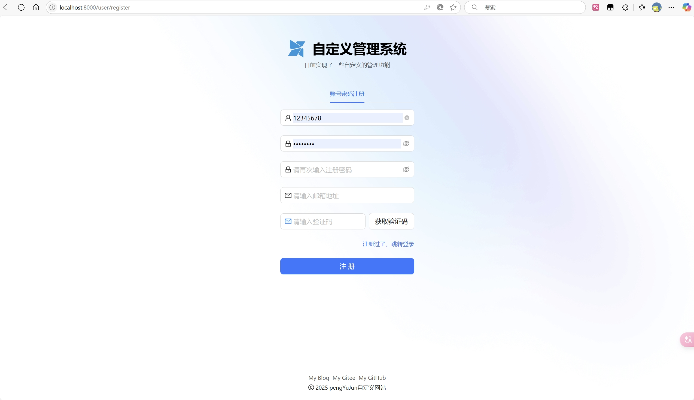
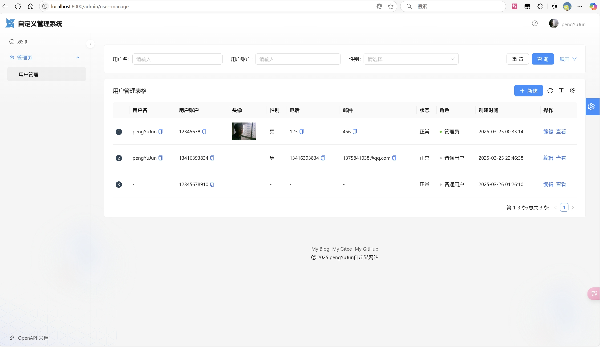

# 用户管理中心系统
## 项目介绍

企业核心的用户中心系统，基于SpringBoot后端+React前端的全栈项目，实现了用户注册、登录以及CRUD等基础功能。

如图：

## 技术选型

**前端**

主要运用阿里Ant Design生态

* HTML+CSS+JavaScript三件套
* React开发框架
* Ant Design Pro 项目模板
* Ant Design 端组件库
* Umi 开发框架
* Umi Request 请求库
* 正向和反向代理

**后端**

* Java 编程语言
* Spring + SpringMVC + SpringBoot 框架
* MyBatis + MyBatis Plus 数据访问框架
* MySQL 数据库
* jUnit 单元测试库
